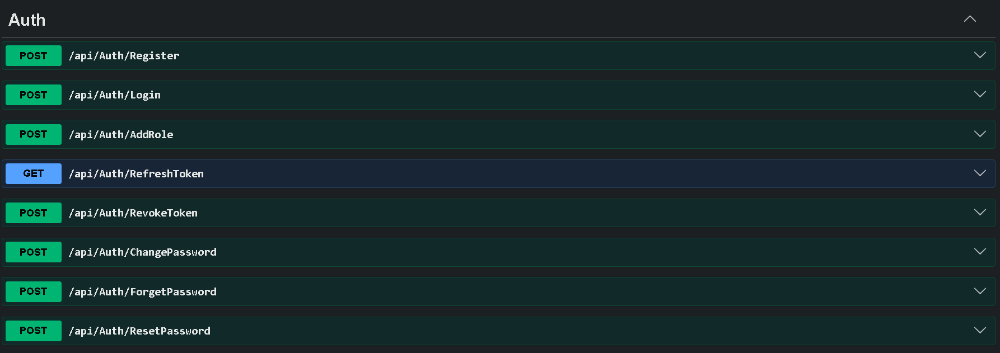
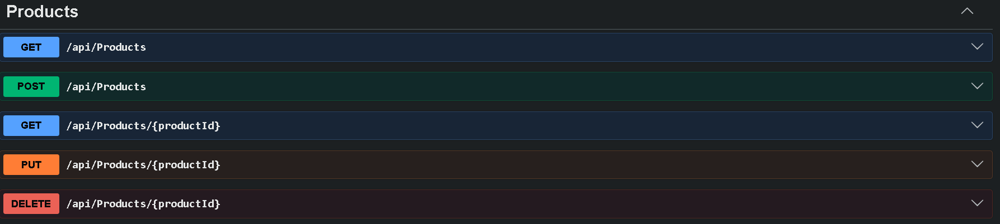
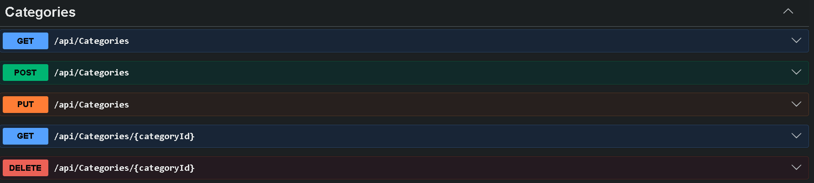
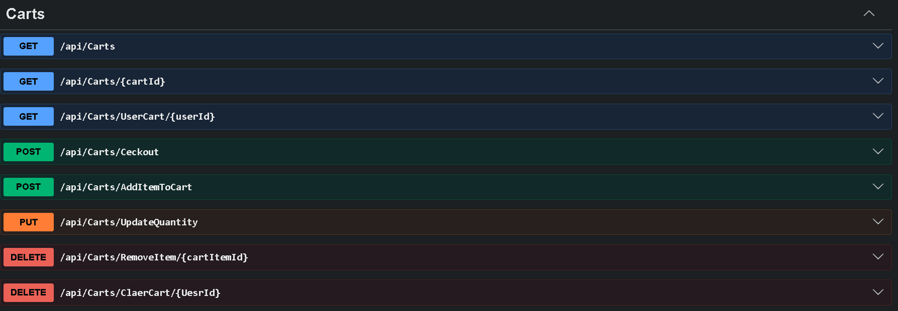
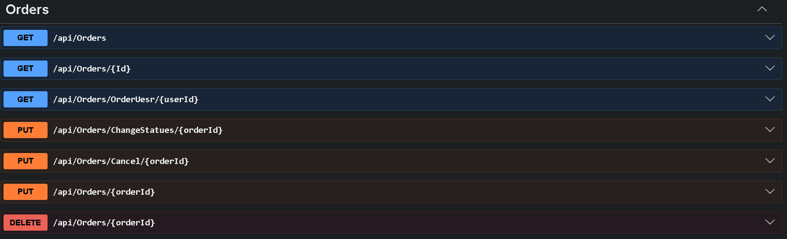

# 🛒 E-Commerce Electronics API

A modern **ASP.NET Core Web API** for an Electronics E-Commerce platform built with **.NET 8** following best practices and clean software architecture principles.

The project provides a complete backend solution including authentication, product management, shopping cart, order management, and online payment integration using **Stripe**.

---

# 🚀 Overview

This project is a complete RESTful API for an electronics store.

It allows users to:

- Register and Login securely
- Browse products
- Manage shopping carts
- Place and manage orders
- Pay online using Stripe
- Manage products, brands, and categories
- Manage user accounts

The project follows a layered architecture with separation of concerns to make the application scalable and maintainable.

---

# ✨ Features

### 🔐 Authentication & Authorization

- User Registration
- Login
- JWT Authentication
- Refresh Token
- Revoke Refresh Token
- Assign Roles
- Change Password
- Forgot Password
- Reset Password
- Email OTP Reset Password
- Secure Identity Management

---

# 🛠 Technologies & Tools

- ASP.NET Core Web API (.NET 10)
- Entity Framework Core
- LINQ
- SQL Server
- AutoMapper
- ASP.NET Core Identity
- JWT Authentication
- Refresh Tokens
- MailKit
- Stripe Payment Gateway
- CQRS
- MediatR
- Unit of Work Pattern
- Repository Pattern
- Dependency Injection

---

# 🏛 Architecture

The project is built using **3-Tier Architecture**.

```
Presentation Layer
        │
Business Layer
        │
Data Access Layer
```

Design Patterns used:

- Repository Pattern
- Unit of Work
- CQRS
- Dependency Injection

This architecture makes the project:

- Maintainable
- Scalable
- Testable
- Easy to extend

---

# 🔐 Authentication Flow

Authentication is implemented using:

- ASP.NET Identity
- JWT Access Token
- Refresh Token

Password operations include:

- Change Password
- Forgot Password
- Reset Password
- Email OTP using MailKit

Role-based authorization is also implemented to secure API endpoints.

---
### 👤 User Management

- Get User Information
- Identity Integration
- Role Management

---

### 📦 Products

- Create Product
- Update Product
- Delete Product
- Get Product
- Get All Products
- Product Images
- Price
- Discount
- Product Details

---

### 🏷 Categories

- Create Category
- Update Category
- Delete Category
- Get Categories

---

### 🏢 Brands

- Create Brand
- Update Brand
- Delete Brand
- Get Brands

---

### 🛒 Shopping Cart

- Create Cart
- Get Cart
- Update Cart
- Delete Cart
- Add Item to Cart
- Update Item Quantity
- Remove Item
- Clear Cart
- Calculate Total Price

---

### 📋 Orders

- Create Order
- Get Orders
- Update Order
- Delete Order
- Change Order Status
- Cancel Order

---

### 💳 Payments

Stripe Integration includes:

- Create Customer
- Create Charge
- Secure Payment Processing

---

# 📸 API Endpoints Screenshots

## Authentication



```
```

---

## Products



```
```

---

## Categories



```
```

---

## Brands


```
```

---

## Shopping Cart



```
```

---

## Orders



```
```

---

## Payments


```
```

---

# 🔮 Future Improvements

- Product Search
- Product Filtering
- Product Sorting
- Coupon System
- Pagination
- Order Tracking
- Email Notifications
- Docker Support
- Redis Caching
- Logging
- CI/CD Pipeline

---

# 👨‍💻 Author

**Eslam Aboalnaga**

- GitHub: https://github.com/EslamAboalnaga22
- LinkedIn: [@Eslam Aboalnaga](https://www.linkedin.com/in/eslam-aboalnaga/)
